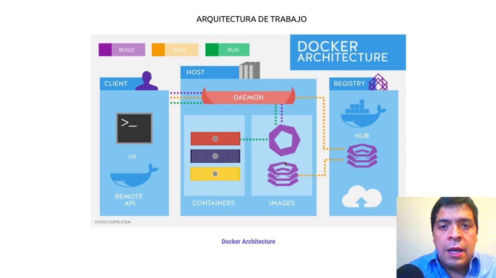
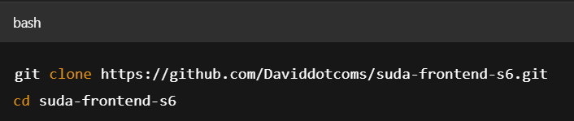
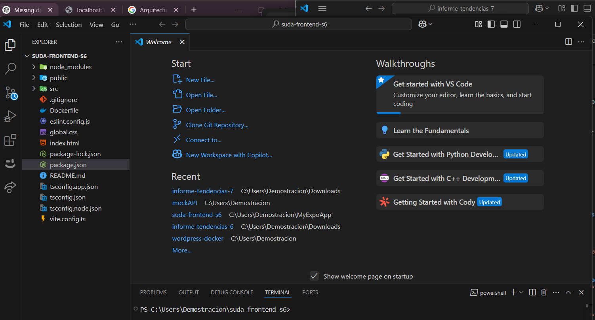
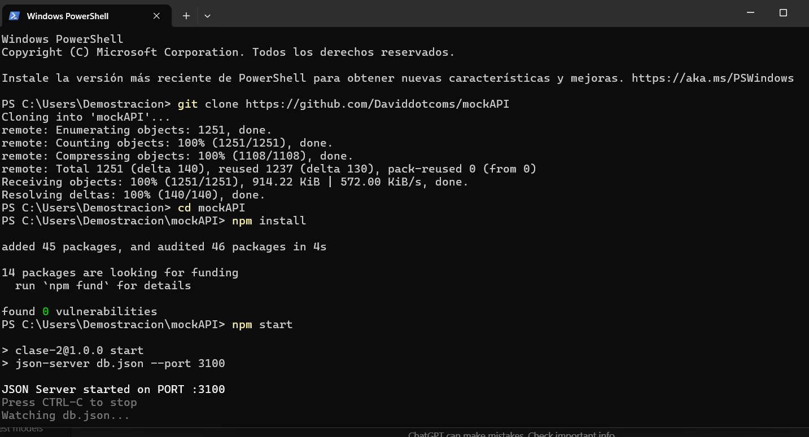
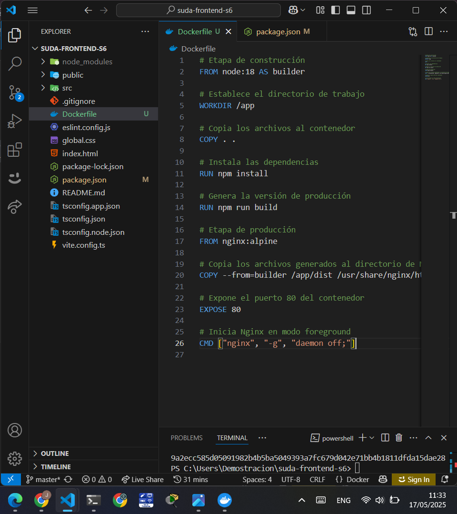
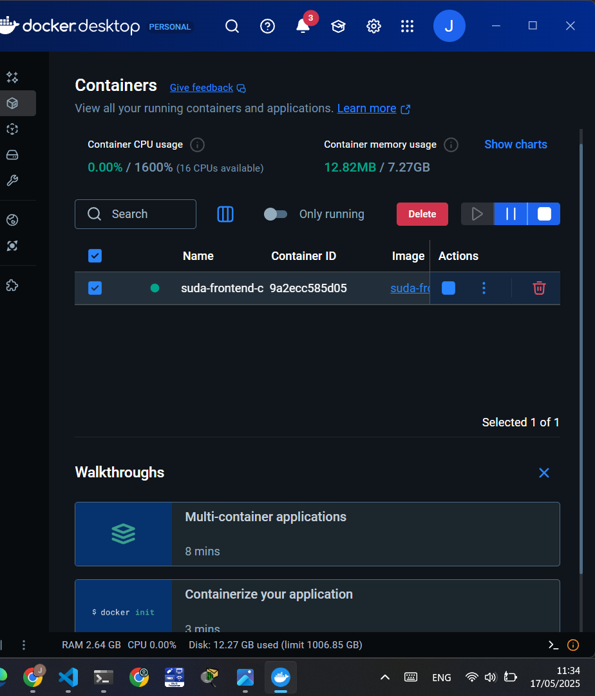
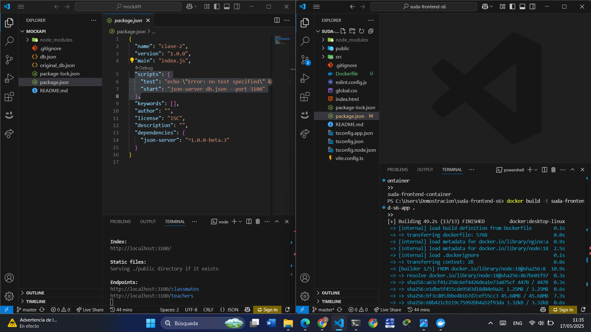
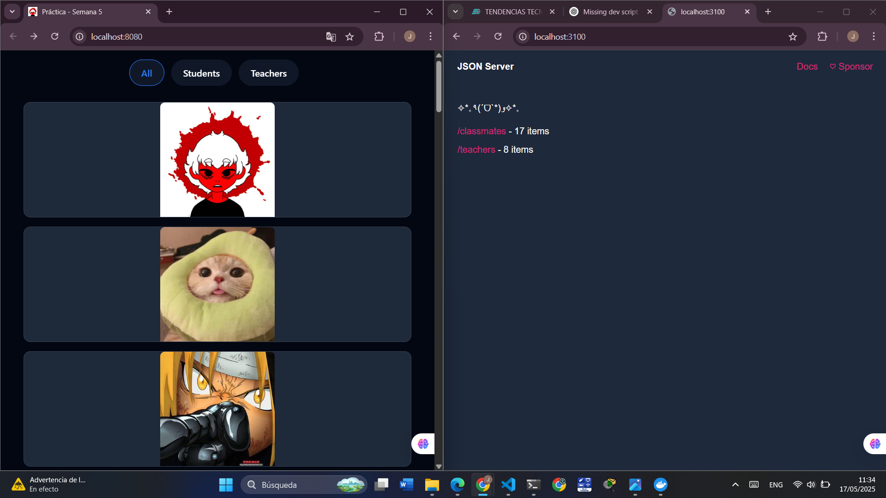
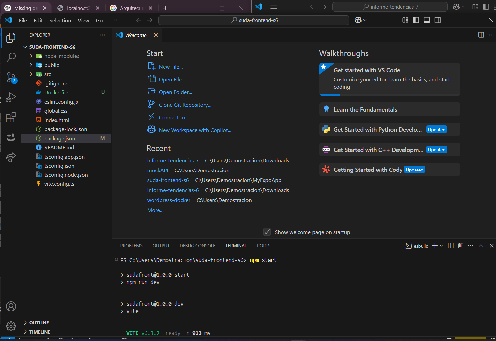

# Servidor Web
## 1. Titulo
Contenerización de una Aplicación React con Docker y Servidor Nginx
## 2. Tiempo de duración
90  minutos.
## 3. Fundamentos:
Docker es una plataforma que permite empaquetar una aplicación junto con todas sus dependencias en un contenedor ligero y portable. Esto asegura que la aplicación funcione de forma idéntica en cualquier entorno, ya sea en desarrollo, pruebas o producción.
Los contenedores Docker funcionan usando imágenes, las cuales contienen todo lo necesario para ejecutar una aplicación. En esta práctica, se utiliza una imagen base de Node.js para construir la aplicación React, y luego se usa Nginx para servir la versión estática optimizada de la aplicación.

La contenerización permite que los desarrolladores eviten el clásico problema de “funciona en mi máquina” y simplifica el despliegue en servidores o en la nube. Además, Docker facilita la escalabilidad y la gestión de versiones de la aplicación.

Para construir la imagen se escribe un archivo llamado Dockerfile, donde se describen los pasos necesarios para crear el contenedor, desde copiar archivos hasta ejecutar comandos. Esto permite reproducir y compartir la configuración exacta del entorno.

Figura 1. Arquitectura básica de contenedores Docker para aplicaciones frontend con React y Nginx.

Fuente: Docker.com

En esta práctica también se usó un backend simulado para pruebas, corriendo en un contenedor aparte o localmente, lo que permite separar responsabilidades y facilita el desarrollo y prueba de la interfaz frontend.

## 4. Conocimientos previos.
   
- Uso básico de comandos en consola o terminal (Linux/Windows/Mac).

- Manejo básico de Git para clonar repositorios.

- Fundamentos de React y cómo ejecutar proyectos con npm.

- Conceptos básicos de Docker: imágenes, contenedores, comandos docker build, docker run.

- Navegación y uso de navegadores web para visualizar aplicaciones locales.

 

## 5. Objetivos a alcanzar
- Clonar y ejecutar localmente una aplicación React para verificar su funcionamiento.

- Crear un archivo Dockerfile adecuado para contenerizar la aplicación React.

- Construir una imagen Docker a partir del Dockerfile.

- Ejecutar un contenedor con la aplicación contenida usando Nginx como servidor web.

- Verificar el funcionamiento correcto de la aplicación desde el contenedor.
  
## 6. Equipo necesario:
- Computador con sistema operativo Windows, Linux o MacOS.

- Instalación de Docker Desktop (versión mínima 20.xx.xx).

- Conexión a internet para clonar repositorios y descargar imágenes Docker.

- Editor de texto o IDE (VSCode recomendado).

- Navegador web actualizado (Chrome, Firefox, etc.).
- Terminal o consola (PowerShell, CMD, bash).
## 7. Material de apoyo.
- Documentación oficial de Docker: https://docs.docker.com/

- Guía oficial de React: https://reactjs.org/docs/getting-started.html

- Cheat sheet de comandos básicos de Docker: https://dockerlabs.collabnix.com/docker/cheatsheet/

*  Repositorios oficiales:

- Frontend React: https://github.com/Daviddotcoms/suda-frontend-s6

- Backend simulado: https://github.com/Daviddotcoms/mockAPI

  
## 8. Procedimiento

### Paso 1: Paso 1: Clonar el repositorio frontend y Instalar dependencias y ejecutar localmente.

### Paso 2: Clonar y ejecutar backend simulado.

### Paso 3:Crear archivo Dockerfile en la carpeta del frontend.

### Paso 4: Construir la imagen Docker.
docker build -t suda-frontend .

### Paso 5: Crear y correr el contenedor.
docker run -d -p 8080:80 --name suda-container suda-frontend

## 9. Resultados esperados

Se espera que la aplicación React se ejecute correctamente dentro del contenedor Docker y que sea accesible desde el navegador web en http://localhost:3000. Además, el backend simulado debe estar corriendo para proporcionar datos al frontend.

Aplicación funcionando localmente (npm start).

Terminal con imagen Docker creada.

Contenedor Docker corriendo.

Aplicación React corriendo desde el contenedor.

## 10. Bibliografía

* Docker Documentation. (2024). Docker docs. https://docs.docker.com/

* Merkel, D. (2014). Docker: lightweight Linux containers for consistent development and deployment. Linux Journal, (239).

* React Documentation. (2024). React Official Docs. https://reactjs.org/docs/getting-started.html

